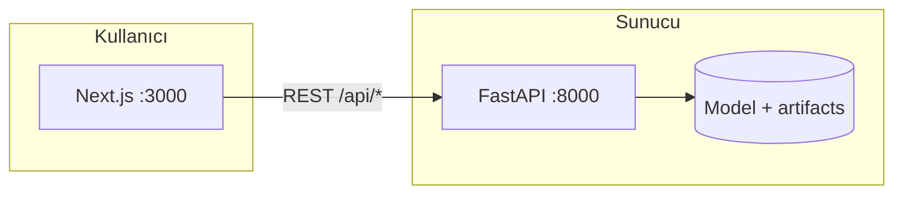

<div align="center">

# Meme Kanseri Tespiti — Demo

**Wisconsin Breast Cancer** veri setiyle eğitilmiş bir **Random Forest** modeli; **FastAPI** REST API ve **Next.js** arayüzü ile birlikte sunulur.

[](https://www.python.org/)
[](https://fastapi.tiangolo.com/)
[](https://nextjs.org/)
[](https://scikit-learn.org/)
[](https://docs.docker.com/compose/)

[Özellikler](#-bu-proje-ne-yapar) · [Hızlı başlangıç](#-hızlı-başlangıç-docker) · [Yerel geliştirme](#-yerel-geliştirme) · [API](#-api-özeti) · [Proje yapısı](#-proje-yapısı)

</div>

---

> **Önemli:** Bu proje **eğitim ve demo** amaçlıdır. Tıbbi tanı veya tedavi kararı için **kullanılmamalıdır**; gerçek klinik kararlar yalnızca uzman hekimler tarafından verilir.

---

## Bu proje ne yapar?

| Bileşen | Açıklama |
|--------|----------|
| **Model** | `sklearn` içindeki meme kanseri veri seti ile **Random Forest** sınıflandırıcısı eğitilir; tahmin **iyi huylu (benign)** veya **kötü huylu (malignant)** etiketidir. |
| **API** | Özellik vektörü alır, olasılık ve sınıf döner; veri özeti ve örnek değer uçları sunar. |
| **Arayüz** | Next.js ile tahmin formu ve sonuç paneli (Türkçe / İngilizce dil seçeneği). |



---

## Hızlı başlangıç (Docker)

Tek komutla API ve web arayüzünü ayağa kaldırır.

**Gereksinimler:** [Docker](https://docs.docker.com/get-docker/) ve Docker Compose.

```bash
docker compose up --build
```

| Adres | Ne var? |
|-------|---------|
| [http://localhost:3000](http://localhost:3000) | Next.js arayüzü |
| [http://localhost:8000/docs](http://localhost:8000/docs) | API interaktif dokümantasyonu (Swagger) |
| [http://localhost:8000/api/health](http://localhost:8000/api/health) | Sağlık kontrolü |

> Docker imajı oluşturulurken `train.py` çalışır; model artifact’ları **konteyner içinde** üretilir. İlk build birkaç dakika sürebilir.

---

## Yerel geliştirme

### 1. Backend (API)

```bash
# Sanal ortam (önerilir)
python -m venv .venv

# Windows PowerShell
.\.venv\Scripts\Activate.ps1

pip install -r requirements.txt
python train.py          # artifacts/ altına model.joblib ve feature_names üretir
uvicorn app.main:app --reload --host 0.0.0.0 --port 8000
```

API: [http://127.0.0.1:8000/docs](http://127.0.0.1:8000/docs)

### 2. Frontend (Next.js)

Ayrı bir terminalde:

```bash
cd frontend
npm install
```

Geliştirme sunucusu için API adresini iletin:

```bash
# Windows PowerShell
$env:NEXT_PUBLIC_API_URL="http://localhost:8000"; npm run dev
```

```bash
# macOS / Linux
NEXT_PUBLIC_API_URL=http://localhost:8000 npm run dev
```

Arayüz: [http://localhost:3000](http://localhost:3000)

---

## API özeti

Tüm yollar `/api` ön eki ile başlar.

| Yöntem | Yol | Açıklama |
|--------|-----|----------|
| `GET` | `/api/health` | Servis ayakta mı? |
| `GET` | `/api/meta` | Özellik isimleri ve veri seti meta bilgisi |
| `GET` | `/api/sample-benign-means` | Örnek iyi huylu ortalama değerler |
| `POST` | `/api/predict` | Özelliklerle tahmin |

---

## Proje yapısı

```
breast-cancer-detection/
├── app/                 # FastAPI uygulaması (routers, servisler, şemalar)
├── frontend/            # Next.js 15 (App Router, TypeScript)
├── static/              # Basit statik HTML/JS örnekleri (isteğe bağlı)
├── train.py             # Model eğitimi ve artifact üretimi
├── artifacts/           # Üretilir: model.joblib, feature_names.joblib (Git’e alınmaz)
├── Dockerfile           # API imajı (build sırasında train çalışır)
├── docker-compose.yml   # api (8000) + web (3000)
└── requirements.txt
```

---

## Teknoloji yığını

| Katman | Teknoloji |
|--------|-----------|
| ML | scikit-learn (Random Forest), joblib, NumPy |
| Backend | FastAPI, Uvicorn, Pydantic |
| Frontend | Next.js 15, React 19, TypeScript |
| DevOps | Docker, Docker Compose |

---

## Sık sorulanlar

**`artifacts` klasörü boş / API başlamıyor**  
Yerelde bir kez `python train.py` çalıştırın. Docker kullanıyorsanız build sırasında zaten üretilir.

**Frontend API’ye bağlanamıyor**  
`NEXT_PUBLIC_API_URL` değerinin tarayıcının erişebileceği tam URL olduğundan emin olun (ör. `http://localhost:8000`). Docker Compose’ta bu değer `docker-compose.yml` içinde build argümanı olarak verilir.

---

## Lisans ve kaynak

- Veri seti: scikit-learn [load_breast_cancer](https://scikit-learn.org/stable/modules/generated/sklearn.datasets.load_breast_cancer.html) (Wisconsin Breast Cancer veri setine dayalı).
- Bu depo: eğitim amaçlı açık kaynak demo.

---

<div align="center">

**[GitHub’da yıldız vermek](https://github.com/ozcan-kutlu/breast-cancer-detection)** projeyi görünür kılar.

</div>
