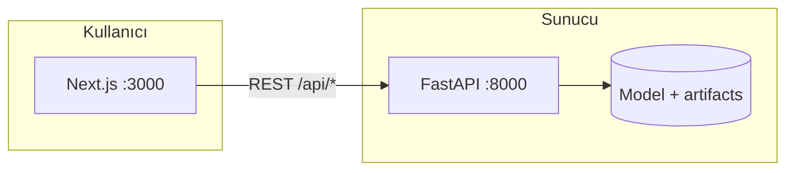

<div align="center">

# Meme Kanseri Tespiti — Demo

**Wisconsin Breast Cancer** veri setiyle eğitilmiş bir **Random Forest** modeli; **FastAPI** REST API ve **Next.js** arayüzü ile birlikte sunulur.

[](https://www.python.org/)
[](https://fastapi.tiangolo.com/)
[](https://nextjs.org/)
[](https://scikit-learn.org/)
[](https://docs.docker.com/compose/)

[Özellikler](#overview) · [Arayüz](#ui) · [Docker](#docker) · [Vercel](#vercel) · [Yerel geliştirme](#local-dev) · [API](#api) · [SSS](#faq)

</div>

---

> **Önemli:** Bu proje **eğitim ve demo** amaçlıdır. Tıbbi tanı veya tedavi kararı için **kullanılmamalıdır**; gerçek klinik kararlar yalnızca uzman hekimler tarafından verilir.

---

<a id="overview"></a>

## Bu proje ne yapar?

| Bileşen | Açıklama |
|--------|----------|
| **Model** | `sklearn` içindeki meme kanseri veri seti ile **Random Forest** sınıflandırıcısı eğitilir; tahmin **iyi huylu (benign)** veya **kötü huylu (malignant)** etiketidir. |
| **API** | Özellik vektörü alır, olasılık ve sınıf döner; veri özeti ve örnek değer uçları sunar. |
| **Arayüz** | Tahmin formu, sonuç paneli, **Türkçe / İngilizce** dil seçimi ve **açık / koyu tema** (tercihler tarayıcıda saklanır). |



---

<a id="ui"></a>

## Arayüz

- **Navbar:** Marka alanı, aktif sayfa etiketi, tema ve dil kontrolleri.
- **Tipografi:** [Plus Jakarta Sans](https://fonts.google.com/specimen/Plus+Jakarta+Sans) (`next/font`).
- **Tema:** `localStorage` anahtarı `bc_theme` (`light` / `dark`); kayıt yoksa işletim sistemi `prefers-color-scheme` kullanılır. İlk boyamada yanlış tema flaşı olmaması için `beforeInteractive` script ile `data-theme` ayarlanır.
- **Dil:** `localStorage` anahtarı `bc_lang` (`tr` / `en`).

---

<a id="docker"></a>

## Hızlı başlangıç (Docker)

Tek komutla API ve web arayüzünü ayağa kaldırır.

**Gereksinimler:** [Docker](https://docs.docker.com/get-docker/) ve Docker Compose.

```bash
docker compose up --build
```

Arka planda çalıştırmak için: `docker compose up -d --build`

| Adres | Ne var? |
|-------|---------|
| [http://localhost:3000](http://localhost:3000) | Next.js arayüzü |
| [http://localhost:8000/docs](http://localhost:8000/docs) | API interaktif dokümantasyonu (Swagger) |
| [http://localhost:8000/api/health](http://localhost:8000/api/health) | Sağlık kontrolü |

> **Web imajı:** `npm run build` önce **ESLint** çalıştırır, ardından production build üretir. API imajında build sırasında `train.py` ile model artifact’ları oluşturulur. İlk build birkaç dakika sürebilir.

---

<a id="vercel"></a>

## Vercel (yalnızca frontend)

Bu repoda **API ayrı bir sunucudur**; Vercel’e yalnızca Next.js uygulaması bağlanırsa tarayıcı hâlâ bir **FastAPI** adresine ihtiyaç duyar.

1. **Kök dizin:** Vercel proje ayarında **Root Directory** → `frontend`.
2. **Ortam değişkeni (zorunlu):** `NEXT_PUBLIC_API_URL` = canlı API’nizin tam adresi, ör. `https://api-xxx.railway.app`  
   - Tanımlanmazsa kod varsayılan olarak `http://127.0.0.1:8000` kullanır; ziyaretçinin bilgisayarında çalışmayan bir adrese istek gider → **meta / tahmin hataları**.
3. **API’yi internete açın:** FastAPI’yi [Railway](https://railway.app/), [Render](https://render.com/), [Fly.io](https://fly.io/) vb. üzerinde yayınlayın; `train.py` veya artifact’ların orada da üretilmiş olması gerekir. CORS bu projede açıktır (`allow_origins=["*"]`).
4. **Build:** `next.config.ts` içinde `VERCEL` ortamında `output: "standalone"` kullanılmaz (Vercel’in varsayılan Next dağıtımı ile uyum).

---

<a id="local-dev"></a>

## Yerel geliştirme

### 1. Backend (API)

```bash
# Sanal ortam (önerilir)
python -m venv .venv

# Windows PowerShell
.\.venv\Scripts\Activate.ps1

pip install -r requirements.txt
python train.py          # artifacts/ altına model.joblib ve feature_names üretir
uvicorn app.main:app --reload --host 0.0.0.0 --port 8000
```

API: [http://127.0.0.1:8000/docs](http://127.0.0.1:8000/docs)

### 2. Frontend (Next.js)

Yalnızca `frontend/` klasöründe `package.json` bulunur (kökte ayrı Node projesi yok).

```bash
cd frontend
npm install
```

Geliştirme sunucusu (API adresini tarayıcıdan erişilebilir verin):

```bash
# Windows PowerShell
$env:NEXT_PUBLIC_API_URL="http://localhost:8000"; npm run dev
```

```bash
# macOS / Linux
NEXT_PUBLIC_API_URL=http://localhost:8000 npm run dev
```

| Komut | Açıklama |
|-------|----------|
| `npm run dev` | Geliştirme sunucusu (Turbopack) |
| `npm run lint` | [ESLint](https://eslint.org/) 9, `@next/eslint-plugin-next` (flat **core-web-vitals**) + TypeScript |
| `npm run build` | Önce `lint`, sonra `next build` (standalone yalnızca Docker; Vercel’de `VERCEL` ile kapatılır) |

Arayüz: [http://localhost:3000](http://localhost:3000)

---

<a id="api"></a>

## API özeti

Tüm yollar `/api` ön eki ile başlar.

| Yöntem | Yol | Açıklama |
|--------|-----|----------|
| `GET` | `/api/health` | Servis ayakta mı? |
| `GET` | `/api/meta` | Özellik isimleri ve veri seti meta bilgisi |
| `GET` | `/api/sample-benign-means` | Örnek iyi huylu ortalama değerler |
| `POST` | `/api/predict` | Özelliklerle tahmin |

---

## Proje yapısı

```
breast-cancer-detection/
├── app/                      # FastAPI (routers, servisler, şemalar)
├── frontend/
│   └── src/
│       ├── app/              # App Router, global stiller
│       ├── components/       # Navbar, tahmin bileşenleri, tema / dil
│       ├── contexts/         # Dil ve tema (React Context)
│       └── lib/              # API istemcisi, i18n, tema yardımcıları
├── static/                   # İsteğe bağlı basit HTML/JS demo
├── train.py                  # Model eğitimi → artifacts/
├── artifacts/                # model.joblib, feature_names.joblib (Git’e alınmaz)
├── Dockerfile                # API imajı
├── docker-compose.yml        # api :8000 + web :3000
└── requirements.txt
```

---

## Teknoloji yığını

| Katman | Teknoloji |
|--------|-----------|
| ML | scikit-learn (Random Forest), joblib, NumPy |
| Backend | FastAPI, Uvicorn, Pydantic |
| Frontend | Next.js 15.5, React 19, TypeScript, ESLint 9 (flat config) |
| DevOps | Docker, Docker Compose (Node 20 + Python 3.11 imajları) |

---

<a id="faq"></a>

## Sık sorulanlar

**`artifacts` klasörü boş / API başlamıyor**  
Yerelde bir kez `python train.py` çalıştırın. Docker kullanıyorsanız API imajı build sırasında bunu zaten yapar.

**Frontend API’ye bağlanamıyor**  
`NEXT_PUBLIC_API_URL` değerinin tarayıcının erişebileceği tam URL olduğundan emin olun (ör. `http://localhost:8000`). Docker Compose’ta bu değer `docker-compose.yml` içinde web build argümanı olarak verilir.

**Tema veya dil sıfırlandı**  
Tercihler `localStorage` içindedir; site verisini temizlediyseniz veya gizli pencerede açtıysanız varsayılanlara döner (tema: sistem tercihi veya koyu; dil: Türkçe).

**`npm run build` ESLint’te takılıyor**  
Önce `npm run lint` ile hataları düzeltin. Next’in kendi build-içi lint adımı bu projede kapatılmıştır; kalite kontrolü `npm run build` öncesindeki `eslint .` ile yapılır.

**Vercel’de site açılıyor ama veri / tahmin yüklenmiyor**  
`NEXT_PUBLIC_API_URL` tanımlı mı ve gerçekten **yayında bir API**’ye mi işaret ediyor kontrol edin. Değişkeni ekledikten sonra **yeniden deploy** edin (build zamanında gömülür).

---

## Lisans ve kaynak

- Veri seti: scikit-learn [load_breast_cancer](https://scikit-learn.org/stable/modules/generated/sklearn.datasets.load_breast_cancer.html) (Wisconsin Breast Cancer veri setine dayalı).
- Bu depo: eğitim amaçlı açık kaynak demo.

---

<div align="center">

**[GitHub’da yıldız vermek](https://github.com/ozcan-kutlu/breast-cancer-detection)** projeyi görünür kılar.

</div>
